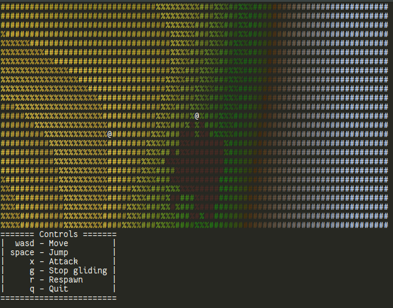

# Teloren ('Telnet' + 'Veloren')

Teloren is an ANSI-compatible terminal frontend to Veloren, the multiplayer RPG voxel game written in Rust.
Teloren is currently still very much a work in progress and I strongly recommend you play with the [3D frontend](https://www.veloren.net) first.



## Usage

Start Teloren using the following arguments:

```
teloren --username YOUR_LOGIN --password YOUR_PASSWORD --character YOUR_CHARACTER
```

Optionally, you may also specify `--server` and `--port` arguments to play on something other than the main public server.

## Status

Currently implemented

- World rendering
- Object rendering
- Basic movement
- Chat

To be implemented

- Build mode
- Lighting
- Alias overlays, HUD
- Picking up objects
- Accepting a group invite

## Why?

Veloren's engine has been deliberately designed in an extremely modular manner.
As a result, graphical frontends are entirely decoupled from the client library itself, and so writing alternative frontends for the game is actually quite easy.
